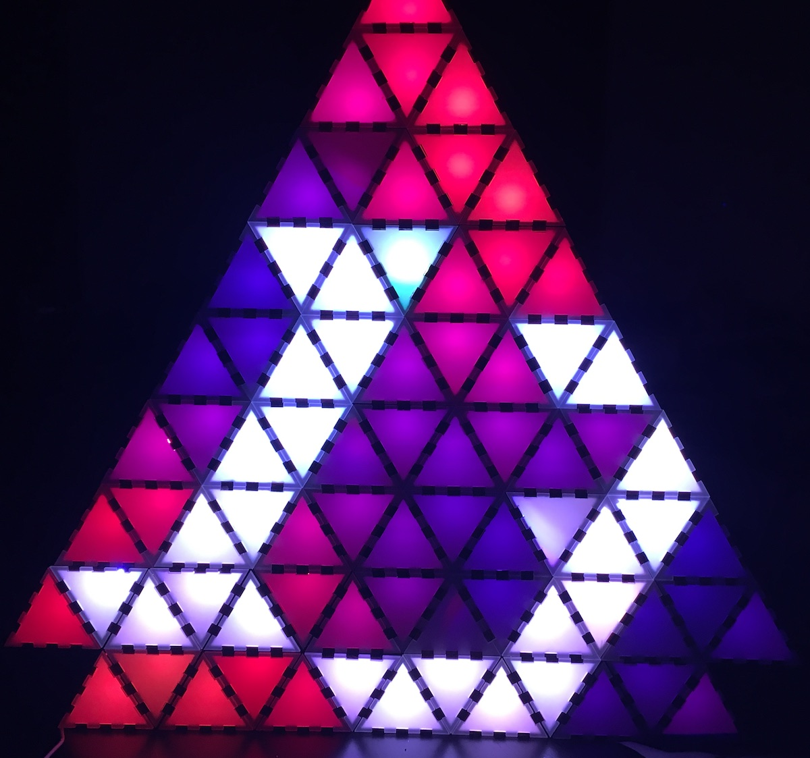

# Stackenlichten

by <a href="https://twitter.com/kellertuer">@kellertuer</a>, <a href="https://twitter.com/k4sp4r">@k4spar</a>.

## Motivation
The idea of this project is to provide a blueprint for single pixels, that
can be connected via magnets. The data and power supply works via connectors.
The pixels themselves are equilateral triangles, that can easier be used to
stack different forms of Lichten.

## Code
Based on the fadecandy chip and its accompanying python code, The code for Stackenlichten encapsulates the interface to the pixel and provides an easy way to implement image and pixel algorithms on graphs.

## A Talk with a Demo
There was a Talk at the [MetaNook 2017](https://metanook.de) by [@kellertuer](https://twitter.com/kellertuer) (in german though). The slides can be viewed [here](http://ronnybergmann.net/vortraege/2017-11-Stackenlichten-MetaNook.pdf) and a recording is available on the [Youtube channel of the MetaNook](https://www.youtube.com/watch?v=ggBUx7R-tWU) (demo starts at about 44 minutes).

## Build your own
In order to build your own Trixels, see [Manual.md](manual/manual.md).

## KuDos
* [Blinkenlichten](http://blinkenlights.net)
* [Stackenblochen](https://www.youtube.com/watch?v=QEN5-_93gQg)
* [inKL](http://chaos-inkl.de) for all 3D printing help
* [@k4spar](http://twitter.com/k4spar) for a lot of laz0r wood and discussions in the begginnig of the trixel idea at the [33c3](https://events.ccc.de/congress/2016/wiki/Main_Page).
* Haruto end eBrnd as well as [FabLab KA](https://fablab-karlsruhe.de) for even more laz0r
