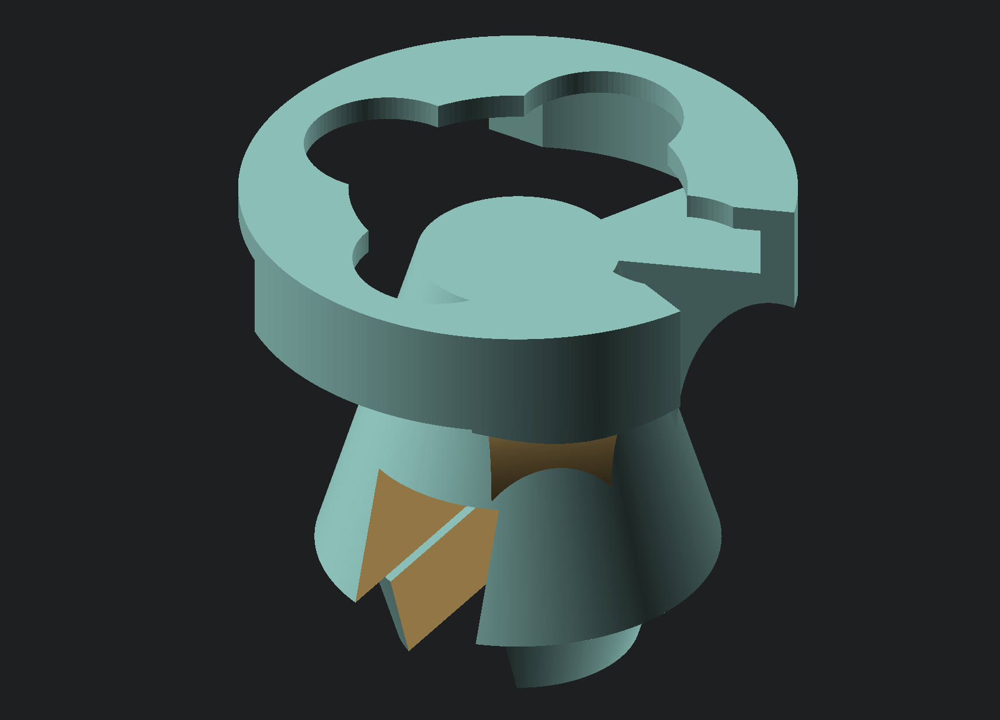
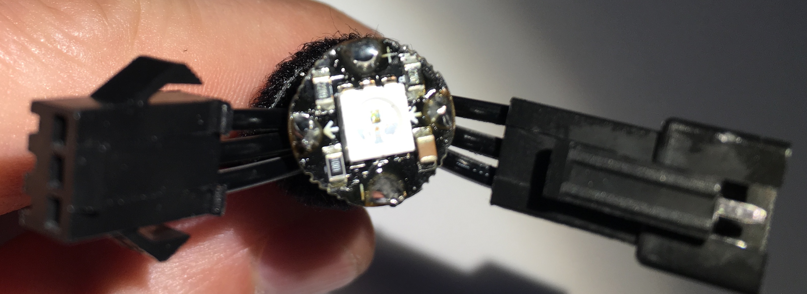
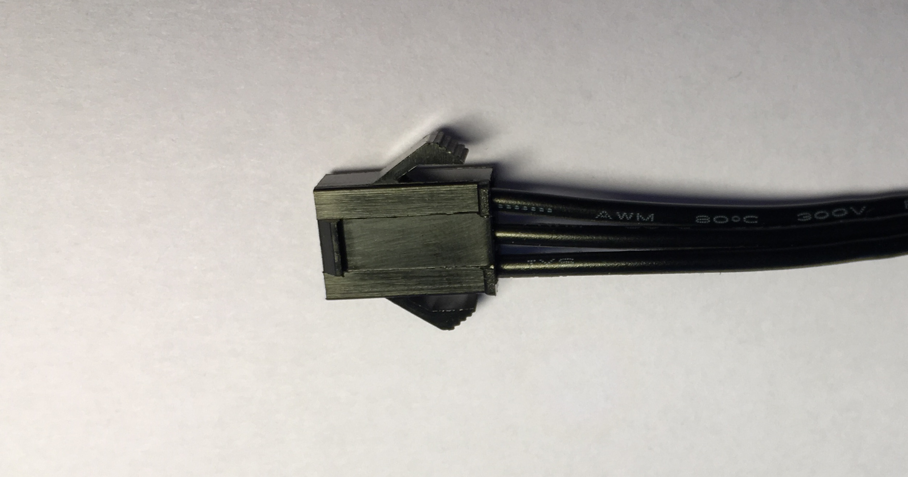
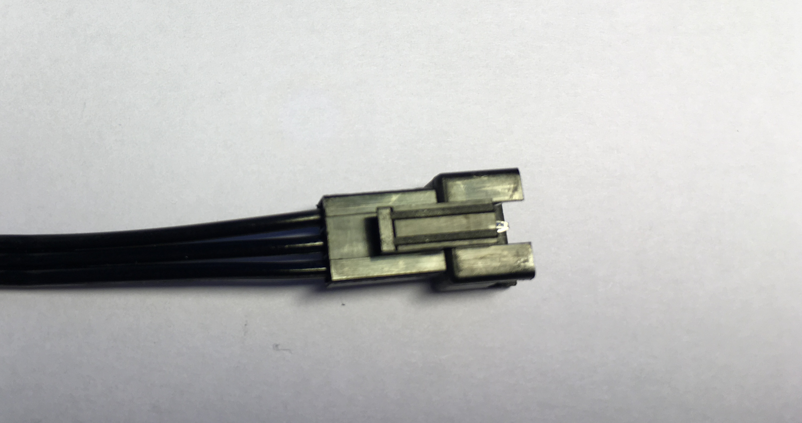
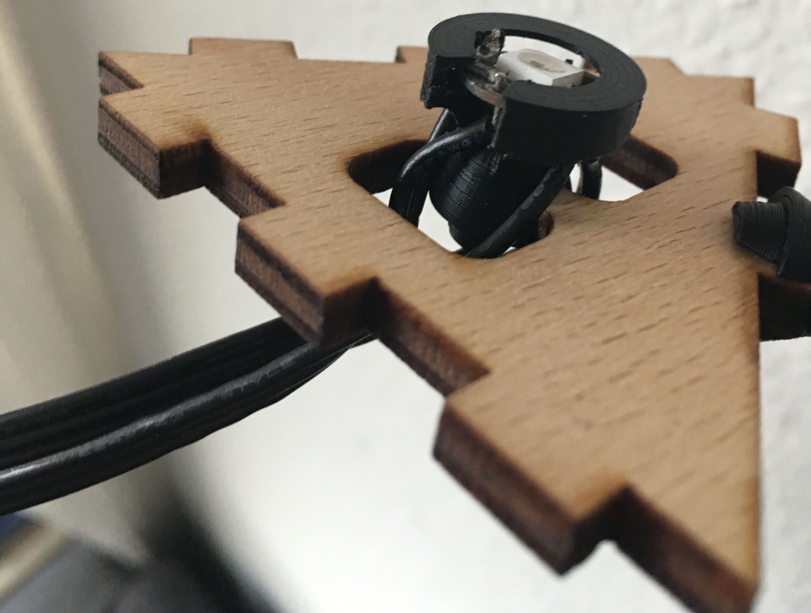

# Stackelichten Build Manual
This short manual explains, how to build your own stackel´nlichten pixel net.

# A LED Trixel

## Required parts
* [Neopixel]([https://learn.adafruit.com/adafruit-neopixel-uberguide/overview) LED (a [WS2812](https://cdn-shop.adafruit.com/datasheets/WS2812.pdf)-type LED)
* 6 [Neodyn magnets](http://www.magnetportal.de/wuerfel/neodym-magnet-wuerfel-n45-4mm-1-3kg/a-64/) of size `4x4x4 mm` (0,10 € from 200 pieces on)
* 1 [Cables for 3 pin](https://www.adafruit.com/products/1663) (1,50 € each) or [the not black cable version](https://www.amazon.com/HKBAYI-50Pair-50sets-Connector-WS2812B/dp/B00NBSH4CA/ref=sr_1_4?s=electronics&ie=UTF8&qid=1491030077&sr=1-4&keywords=JST+SM+3+pin) (0,24 € each)
* Plywood or plastic (ABS) for the case (depends on whether you want wood cases and have a laser or want ABS cases and have a 3D printer)
* ABS for the LED case
* a trabnslucent (acryl) front plate that spreads the LED light (and a laser cutter), e. g. [Plexiglas satinice](http://www.plexiglas.de/product/plexiglas/de/produkte/plexiglas-satinice/pages/default.aspx) works, too)

## Build the case
First of all produce 3 [side plates](../openSCAD/side.scad) and a [bottom plate](../openSCAD/bottom.scad), either cut them from plywood with a laser or print them in a 3D printer.

take the magnets and glue them into the two holes of each of the three sides with opposing magnetization (I still have to check which one has the outpointing north pole in my construction – but mainly you have to stick to the same throughout your project).

Glue all three parts together using either wood glue or aceton.

Furthermore cut one front plate from the translucent acryl plate, see [front plate](../openSCAD/front.scad), see this sketch (now you also now where the logo coms from).

## Prepare the LED
First of all print a LED case. You can already check

[LEDcase-openSCAD](../openSCAD/LED_case.scad).
 Before soldering the LED you can already check, that the case should fit onto the middle bridge of the bottom plate. Note that it might be best to print these upside down, such that you only need a little support for the center code (then pointing downwards).

Wiring your LED should be done something like this, but stop before wiring data out:

i.e. if you look onto the plug pointing to the left,
the top pin is plus, the bottom pin is minus and the center pin is connected to data out.

Similarly for the receptor: if you look upon the receptor (pointing right) the top cable is plus, the bottom cable is minus and its center cable is data in.

When soldering the cables to the LED as shown in the first image, stop and plug the LED into the LED case,
where the Neopixel shown in the image should fit perfectly. If you then wire the data out, the LED also holds within the case.

Now glue the LEDcase to the bottom after putting it onto the small middle bridge.

You can also glue the case to the bottom plate before glueing the three sides and the bottom together (then the bridge is easier reachable)

but for me the glueing of the wood/ABS parts was easier without the LED being inside.

The only thing left for a case is now to fix the front plate. In my tests the ABS just clamps the acryl, while for the wood cases it's a little tricky to fix the front plate

# The controller
