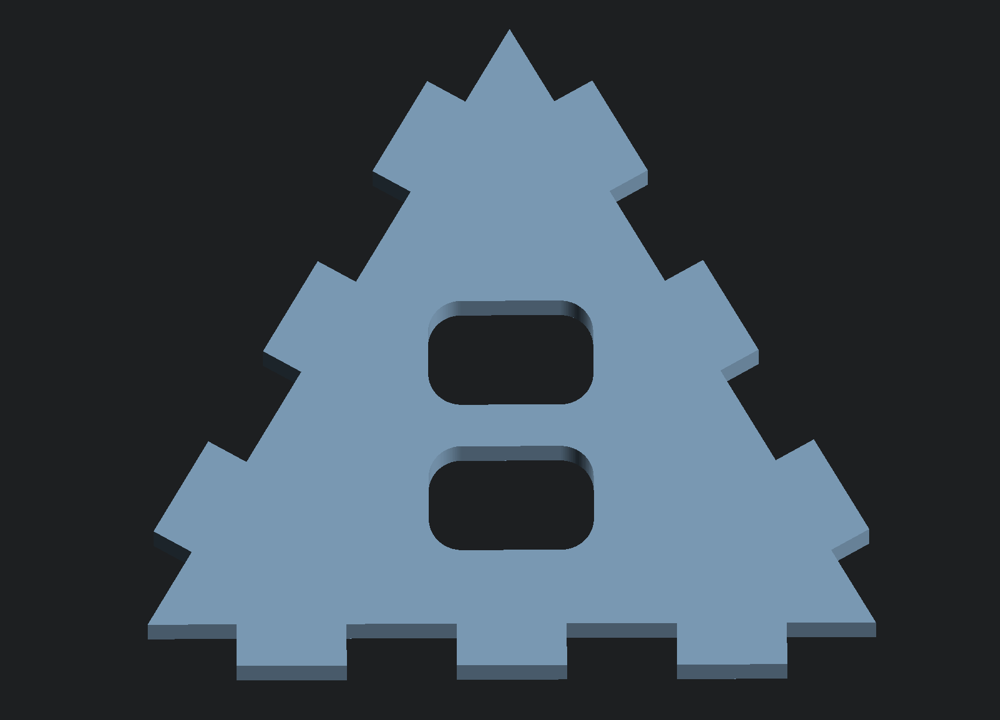
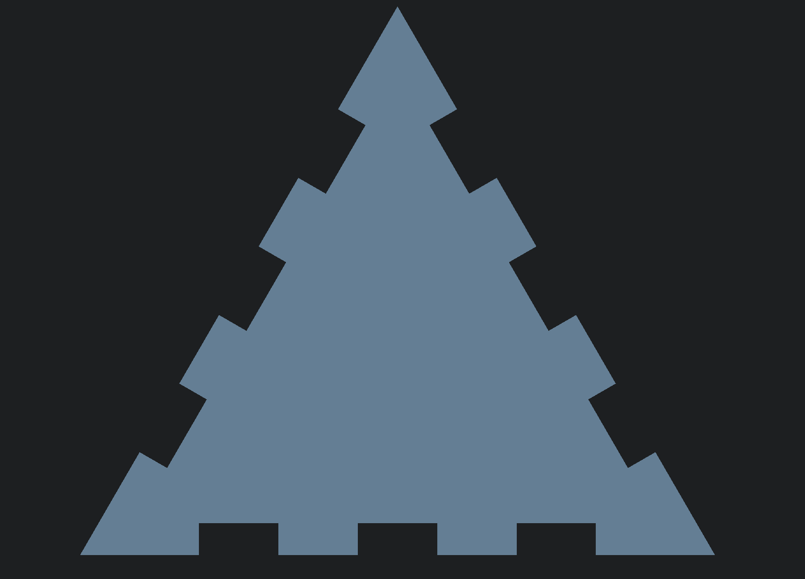

# Stackelichten Build Manual
This short manual explains, how to build your own stackel´nlichten pixel net.

# An LED Trixel

## Required parts
* [Neopixel]([https://learn.adafruit.com/adafruit-neopixel-uberguide/overview) LED (a [WS2812](https://cdn-shop.adafruit.com/datasheets/WS2812.pdf)-type LED)
* 6 [Neodyn magnets](http://www.magnetportal.de/wuerfel/neodym-magnet-wuerfel-n45-4mm-1-3kg/a-64/) of size `4x4x4 mm` (0,10 € from 200 pieces on)
* 1 [Cables for 3 pin](https://www.adafruit.com/products/1663) (1,50 € each) or [the not black cable version](https://www.amazon.com/HKBAYI-50Pair-50sets-Connector-WS2812B/dp/B00NBSH4CA/ref=sr_1_4?s=electronics&ie=UTF8&qid=1491030077&sr=1-4&keywords=JST+SM+3+pin) (0,24 € each)
* Plywood or plastic (ABS) for the case (depends on whether you want wood cases and have a laser or want ABS cases and have a 3D printer)
* ABS for the LED case
* a trabnslucent (acryl) front plate that spreads the LED light (and a laser cutter), e. g. [Plexiglas satinice](http://www.plexiglas.de/product/plexiglas/de/produkte/plexiglas-satinice/pages/default.aspx) works, too)

## Build the case
First of all produce 3 [side plates](../openSCAD/side.scad) and a [bottom plate](../openSCAD/bottom.scad), either cut them from plywood with a laser or print them in a 3D printer.

take the magnets and glue them into the two holes of each of the three sides with opposing magnetization. If you look at a side, e.g. the outside of a plate, make sure that the right magnet is a magnetic south pole (i.e. using a compass the north pole points to the right magnet) and the left magnet is a north pole (i.e. the compass south points towards this one). If you fixed that for one side use this to adjust all others.

Glue all three parts together using either wood glue or aceton.

Furthermore cut one front plate from the translucent acryl plate, see [front plate](../openSCAD/front.scad), see this sketch (now you also now where the logo coms from).

## Prepare the LED
First of all print a LED case. You can already check

[LEDcase-openSCAD](../openSCAD/LED_case.scad).
 Before soldering the LED you can already check, that the case should fit onto the middle bridge of the bottom plate. Note that it might be best to print these upside down, such that you only need a little support for the center code (then pointing downwards).

Wiring your LED should be done something like this, but stop before wiring data out:

i.e. if you look onto the plug pointing to the left,
the top pin is plus, the bottom pin is minus and the center pin is connected to data out.

Similarly for the receptor: if you look upon the receptor (pointing right) the top cable is plus, the bottom cable is minus and its center cable is data in.

When soldering the cables to the LED as shown in the first image, stop and plug the LED into the LED case,
where the Neopixel shown in the image should fit perfectly. If you then wire the data out, the LED also holds within the case.

Now glue the LEDcase to the bottom after putting it onto the small middle bridge.

You can also glue the case to the bottom plate before glueing the three sides and the bottom together (then the bridge is easier reachable)

but for me the glueing of the wood/ABS parts was easier without the LED being inside.

The only thing left for a case is now to fix the front plate. In my tests the ABS just clamps the acryl, while for the wood cases it's a little tricky to fix the front plate.

# The controller

The Python Code in `src/` is based on the MVC model and consists of

* `Pixel.py` containing the class of a single pixel
* `Graph.py` contains a class modelling a set of pixel as vertices in a graph and their edges with length and directions beweteen pixel mid points to model a neighborhood.

* `algorithm.py` a class inheriting the graph as a decorator model to perform algorithms on the graph. The algorithm itself impements both an observer as well as an observable in oder to exchange information between algorithm instances, i.e. between the game `AlgSnake` and a `AlgDigit` to display the score. The algorithms range from metaAlgorithms that combine algorithms to specific small tasks.
* `control.py` a controller class and its children reacting on keyboard inputs and modifying the model, an `Algorithm` using the Observer model. This hence controls exactely one algorithm (that may consist of subalgorithms)
 * A `SimpleControl` just reacting on `Ctrl+C` and turns of the LEDs then (ending the algorithm)
 * A `DirectionControl` taking erfvcd as the 6 directions one may walk on the graph (onto trixel having an adjacent line and not just a triangle edge) as well as walinkt by `kl` turnig left (k) or right(l) by 60 degrees.
* `vizualization.py` the interface `StackenLichtenVisualization` to different views, most prominently encapsulating the OPC library (`opc.py`) that pushed to fadecandy boards and a MatPlotLib and a PyTurtle implementation for programmming the algorithms on a computer, when the Stackenlichten is not available
 * `fadeCandySLV` - pushing the graph to the opc library
 * `PyMatplotSLV` - using the MatplotLib to draw the graph
 * `PyTurtleSLV` - using Python Turtle to display the trixel and algorithms (a little slow).
They all posess a render function that takes a graph to render it onto the given physical context they represent.

In order to run and display an algorithm, write the algorithm itself as a subclass of `Algorithm`, encapsulate this into a `mainAlgorithm`, that takes care of displaying the state of the graph qhile an (an inner algorithm is ) running.
This mainAlgorithm is then passed to the control, which takes care of actually running the algorithm using its `step()` and `isFinished()` functions and passes user actions to the algorithm or all other classdes subscribed as observers to the `Control`.
